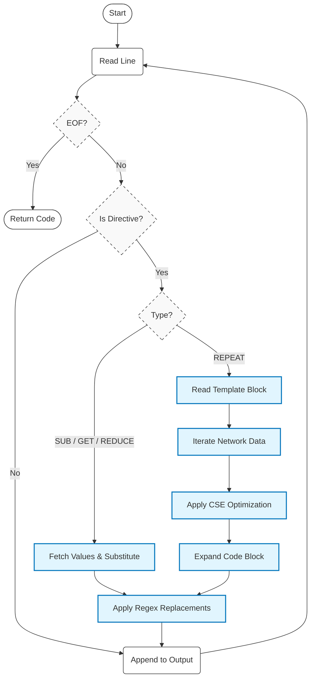

# FileParser API

## Overview

The `Fileparser` class provides the core template parsing functionality for JAFF code generation. It processes template files containing JAFF directives (`SUB`, `REPEAT`, `GET`, etc.) and generates chemical reaction network code for C, C++, and Fortran.

```python
from jaff import Network
from jaff.file_parser import Fileparser
from pathlib import Path

# Load network
net = Network("networks/react_COthin")

# Initialize parser with template
parser = Fileparser(net, Path("templates/rates.cpp"))

# Generate code
output_code = parser.parse_file()

# Save output
with open("src/rates.cpp", "w") as f:
    f.write(output_code)
```

## Algorithm Logic

The Fileparser processes templates using the following control flow.



## Class Definition

```python
class Fileparser:
    def __init__(self, network: Network, file: Path) -> None:
        """
        Initialize the file parser.

        Args:
            network: The loaded chemical reaction network (Network object)
            file: Path to the template file to parse
        """
```

## Attributes

| Attribute | Type           | Description                               |
| --------- | -------------- | ----------------------------------------- |
| `network` | `jaff.Network` | The chemical network used for data source |
| `file`    | `pathlib.Path` | Path object pointing to the template file |

## Core Methods

### `parse_file()`

Parses the entire template file and generates the expanded code string.

```python
output = parser.parse_file()
```

**Returns:**

- `str`: Generated code with all JAFF directives expanded and substitutions applied.

## Data Structures

The module uses specific `TypedDict` structures for internal processing and extension.

### `IdxSpanResult`

Result structure for index span detection in template strings.

```python
class IdxSpanResult(TypedDict):
    offset: list[int]             # Integer offsets for indices (e.g., $idx+1$ -> 1)
    span: list[tuple[int, int]]   # (start, end) character positions of tokens
```

### `CommandProps`

Defines the configuration for a JAFF directive command.

```python
class CommandProps(TypedDict):
    func: Callable[..., Any]            # Function handling the command logic
    props: dict[str, dict[str, Any]]    # Metadata for valid properties (e.g. "species")
```

### `CseProps`

Tracks the state of Common Subexpression Elimination (CSE).

```python
class CseProps(TypedDict):
    parsed: bool    # True if CSE declaration block has been processed
    prefix: str     # Variable prefix (e.g., "const double ")
    var: str        # Variable name (default: "cse")
```

## See Also

- [Network API](network.md) - The source data structure for the parser
- [Species API](species.md) - Details on species properties available via `GET`
- [Reaction API](reaction.md) - Details on rate expressions generated by `rates`
