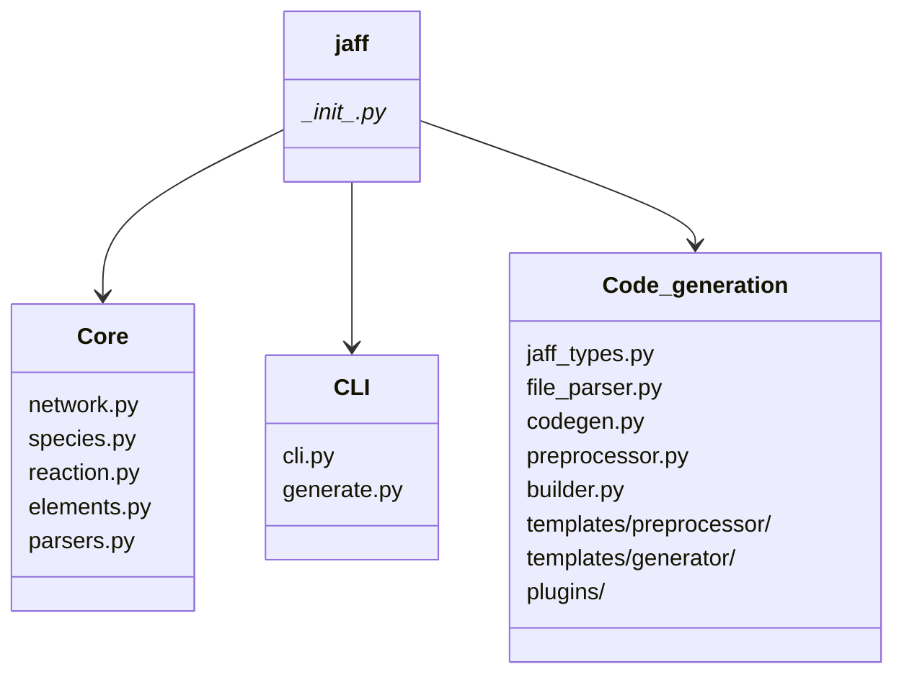

---
tags:
    - Api
    - Introduction
icon: lucide/code
---

# Overview

This section provides detailed documentation for all public APIs, classes, and functions in the JAFF library.

## Core Modules

### Network Management

**[Network](network.md)** - Chemical reaction network loading and management

The Network class is the foundation of JAFF, providing methods to load, parse, and manage chemical reaction networks from various formats.

```python
from jaff import Network

net = Network("networks/react_COthin")
print(f"{len(net.species)} species, {len(net.reactions)} reactions")
```

**Key Features**:

- Multi-format support (KIDA, UDFA, PRIZMO, KROME, UCLCHEM)
- Automatic format detection
- Mass and charge conservation validation
- Species and reaction indexing

---

### Species & Reactions

**[Species](species.md)** - Individual chemical species representation

Access detailed information about chemical species including mass, charge, elemental composition, and more.

```python
species = net.species[0]
print(f"{species.name}: mass={species.mass}, charge={species.charge}")
```

**[Reaction](reaction.md)** - Chemical reaction representation and rate calculations

Work with individual reactions, calculate rate coefficients, and analyze stoichiometry.

```python
reaction = net.reactions[0]
k = reaction.rate(T=100.0)  # Calculate rate at 100K
print(reaction.get_sympy())  # Symbolic representation
```

---

### Code Generation

**[Codegen](codegen.md)** - Multi-language code generator

Generate optimized code for reaction rates, ODEs, Jacobians, and more in C, C++, or Fortran.

```python
from jaff import Codegen

cg = Codegen(network=net, lang="cxx")
rate_code = cg.get_rates(idx_offset=0, rate_var="rate", brac_format="[]")
```

**Supported Languages**:

- C++ (`cxx`)
- C (`c`)
- Fortran 90/95 (`f90`)

**[JAFF Types](jaff-types.md)** - Type definitions for indexed expressions

Specialized data structures for organizing code generation output with indexed values.

```python
from jaff.jaff_types import IndexedValue, IndexedList

# IndexedValue represents array[index] = value
iv = IndexedValue([0], "x + y")

# IndexedList is a type-safe collection of IndexedValue objects
items = IndexedList([IndexedValue([0], "expr1"), IndexedValue([1], "expr2")])
```

**[File Parser](file-parser.md)** - Template-based code generation

Parse template files containing JAFF directives to generate customized code.

```python
from jaff.file_parser import Fileparser
from pathlib import Path

parser = Fileparser(net, Path("template.cpp"))
output = parser.parse_file()
```

---

### Analysis Tools

**[Elements](elements.md)** - Element extraction and matrix generation

Extract chemical elements from species and generate element-related matrices for conservation analysis.

```python
from jaff.elements import Elements

elem = Elements(net)
print(f"Elements: {elem.elements}")
truth_matrix = elem.get_element_truth_matrix()
density_matrix = elem.get_element_density_matrix()
```

---

## Module Structure



All the above files can be found in the `src/jaff` folder. The templates folder contains to sub-folders - `preprocessor` & `generator`. The `preprocessor` folder contains templates than can be generated by the preprocessor. The `generator` contains templates than can gen generated by the [jaffgen command](../user-guide/jaffgen-command.md).

The `Core` files contain the classes and parsers required to parse and store `Network` tokens. The `CLI` file handles command line tasks. The `Code_generation` files contains classes for handeling code-generation using different methods.

---

## Quick API Reference

### Common Imports

```python
# Core functionality
from jaff import Network, Codegen

# Type definitions
from jaff.jaff_types import IndexedValue, IndexedList

# Template parsing
from jaff.file_parser import Fileparser

# Element analysis
from jaff.elements import Elements

# Direct imports
from jaff.species import Species
from jaff.reaction import Reaction
```

### Network Operations

| Operation           | Code                                |
| ------------------- | ----------------------------------- |
| Load network        | `net = Network("file.dat")`         |
| Get species count   | `len(net.species)`                  |
| Get reaction count  | `len(net.reactions)`                |
| Find species index  | `net.species_dict["CO"]`            |
| Find reaction index | `net.reactions_dict["H + O -> OH"]` |
| Access species      | `net.species[0]`                    |
| Access reaction     | `net.reactions[0]`                  |

### Code Generation

| Operation         | Code                                 |
| ----------------- | ------------------------------------ |
| Create generator  | `cg = Codegen(net, "cxx")`           |
| Generate rates    | `cg.get_rates(...)`                  |
| Generate ODEs     | `cg.get_ode(...)`                    |
| Generate Jacobian | `cg.get_jacobian(...)`               |
| Parse template    | `Fileparser(net, path).parse_file()` |

### Element Analysis

| Operation         | Code                                |
| ----------------- | ----------------------------------- |
| Create analyzer   | `elem = Elements(net)`              |
| Get element list  | `elem.elements`                     |
| Get element count | `elem.nelems`                       |
| Truth matrix      | `elem.get_element_truth_matrix()`   |
| Density matrix    | `elem.get_element_density_matrix()` |

---

## Next Steps

Choose a module to explore:

<div class="grid cards" markdown>

- :material-network:{ .lg .middle } **Network API**

    Load and manage chemical networks

    [:octicons-arrow-right-24: Network Reference](network.md)

- :material-code-braces:{ .lg .middle } **Codegen API**

    Generate optimized code

    [:octicons-arrow-right-24: Codegen Reference](codegen.md)

- :material-file-document:{ .lg .middle } **File Parser API**

    Template-based generation

    [:octicons-arrow-right-24: Parser Reference](file-parser.md)

- :material-atom:{ .lg .middle } **Elements API**

    Analyze element composition

    [:octicons-arrow-right-24: Elements Reference](elements.md)

- :material-code-tags:{ .lg .middle } **JAFF Types API**

    Type-safe indexed expressions

    [:octicons-arrow-right-24: Types Reference](jaff-types.md)

</div>

---

## Getting Help

- **User Guide**: Read the [User Guide](../user-guide/loading-networks.md)
- **Examples**: Check the `examples/` directory
- **Issues**: Report bugs on [GitHub](https://github.com/tgrassi/jaff/issues)
